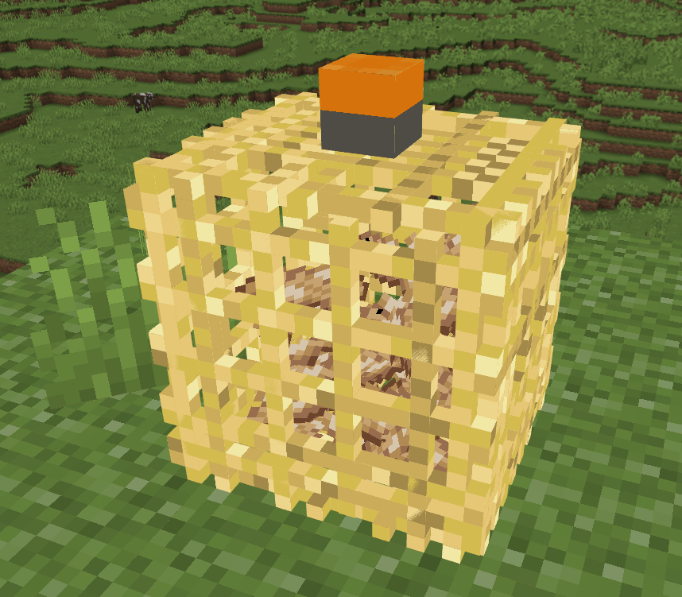
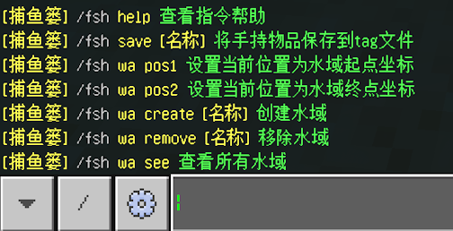
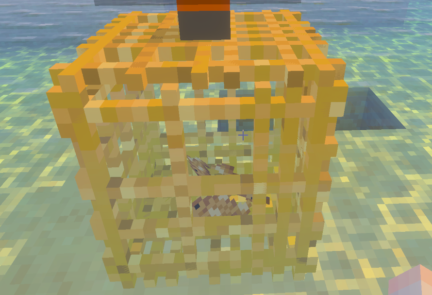
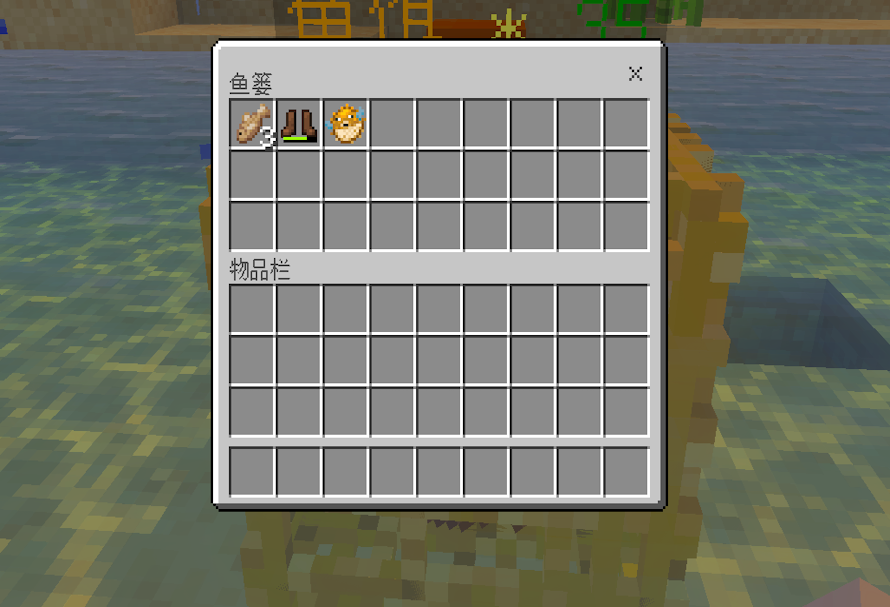

# 🎣 FishBasket - 智能自动钓鱼系统



> 革命性的Nukkit自动钓鱼解决方案，通过放置鱼篓实现全自动钓鱼，支持多水域差异化配置

## 🚀 核心优势

- **全自动运作**：放置鱼篓后自动工作，解放玩家双手
- **智能鱼饵管理**：可配置鱼饵消耗 (`working-food`)
- **水域专属鱼获**：不同水域可配置不同物品 (`water_area.yml`)
- **灵活时间控制**：自定义钓鱼间隔 (`fish-get-time`)
- **丰富物品支持**：兼容原版和自定义NBT物品

## 🛠️ 快速开始

1. 放置鱼篓到水中
2. 放入鱼饵 (数量由`working-food`控制)
3. 系统自动按间隔钓鱼 (`fish-get-time`)
4. 从鱼篓收获物品

## ⚙️ 命令大全

| 命令 | 示例 | 描述 | 权限 |
|------|------|------|------|
| 保存物品 | `/fsh save 金鱼` | 保存手持物品为模板 | op |
| 设置起点 | `/fsh wa pos1` | 标记水域起点坐标 | op |
| 设置终点 | `/fsh wa pos2` | 标记水域终点坐标 | op |
| 创建水域 | `/fsh wa create 湖泊` | 创建新钓鱼水域 | op |
| 删除水域 | `/fsh wa remove 河流` | 删除指定水域 | op |
| 预览水域 | `/fsh wa see 海洋` | 可视化水域范围 | op |

## ⚡ 性能优化

- **高效存储**：SQLite数据库管理水域数据
- **异步处理**：钓鱼逻辑不影响主线程
- **智能缓存**：减少重复数据库查询

## 📝 配置详解

```yaml
# config.yml
fish-get-time: "10~20" # 钓鱼间隔(秒)
working-food: 1        # 每次消耗鱼饵数量

fish-list:             # 全局鱼获列表
  - "minecraft:cod~4"   # 物品ID~权重
  - "301:0~2"          # 自定义物品支持
```

```yaml
# water_area.yml
water_area:
  "珊瑚礁":             # 水域名称
    - "minecraft:tropical_fish~5" # 专属鱼获
    - "minecraft:coral~3"        # 不同权重
```

## 🖼️ 界面预览

| 功能    | 截图                        | 说明      |
|-------|---------------------------|---------|
| 鱼篓放置  |  | 水中放置效果  |
| 物品保存  |  | 保存自定义物品 |
| 物品可视化 |  | 可视化容量   |
| 物品获取  |  | 收取鱼类物品  |
```


